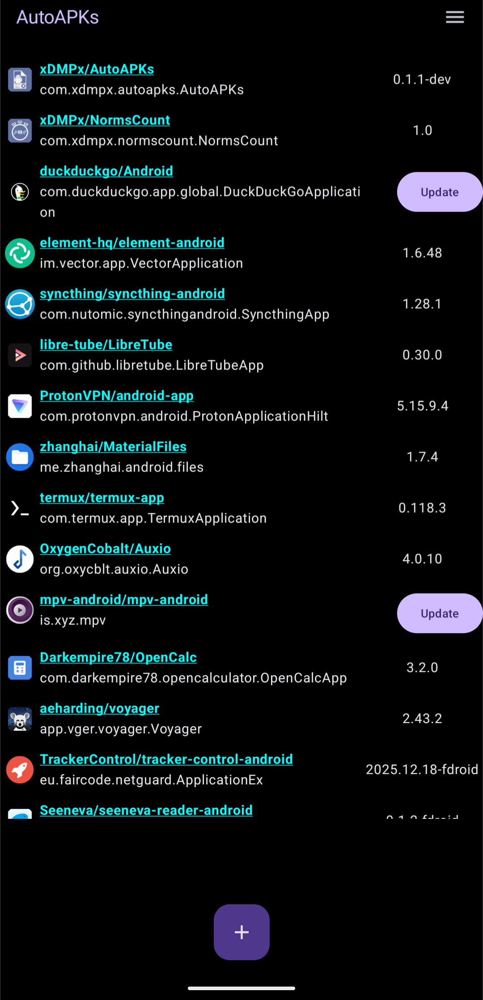
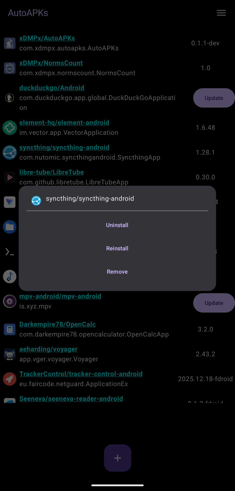
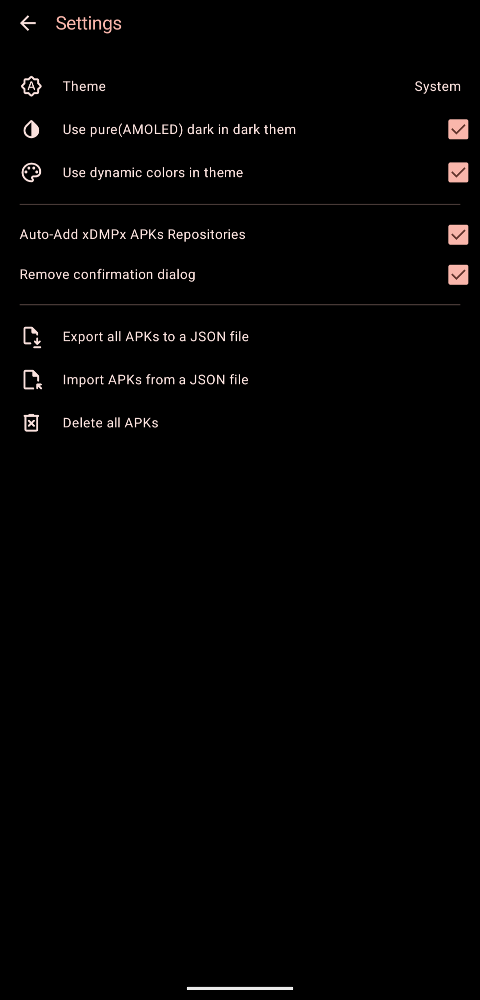
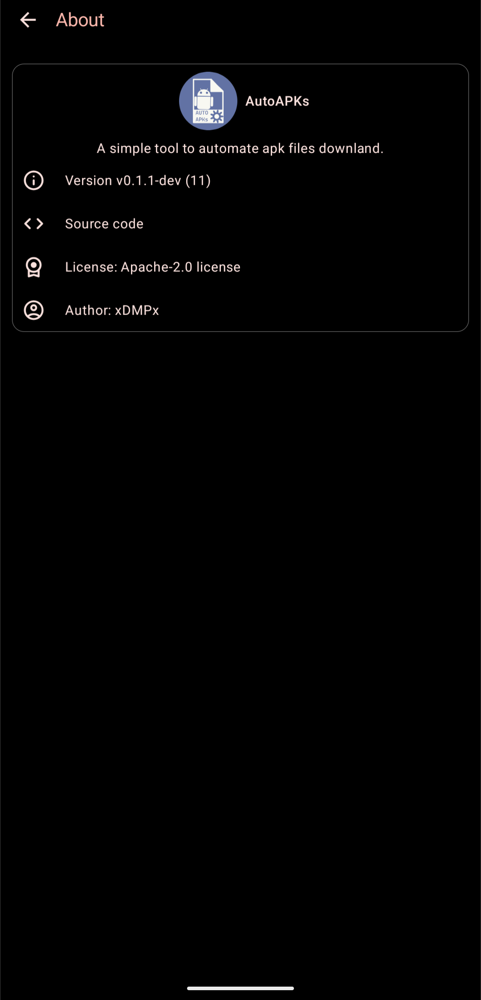

#  AutoAPKs

A simple tool that automates downloading of Android APK files from GitHub.

## Preview

## Features

 - App managment
  - Update detection based on releases pages
  - Uninstaling
  - Reinstaling
  - Quick acces to "App info"
 - Theme control
 - Support for AMOLED dark
 - Exporting and importing (JSON)
 - Compatibility with repositories that have custom names/locations of "app" directory
 - Quick access to apps released by me

## Building

To build it, clone the repository, open the project in Android Studio, and then build and install it on an Android device or emulator.

## Downloads 

The application is currently distributed only as APK via <a href="/xdmpx/AutoAPKs/releases">releases</a> page.

 

## License

This project is licensed under [Apache-2.0](LICENSE) License.
